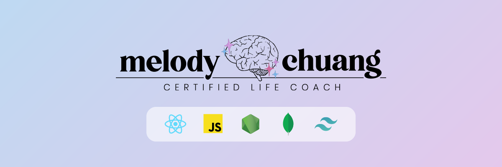
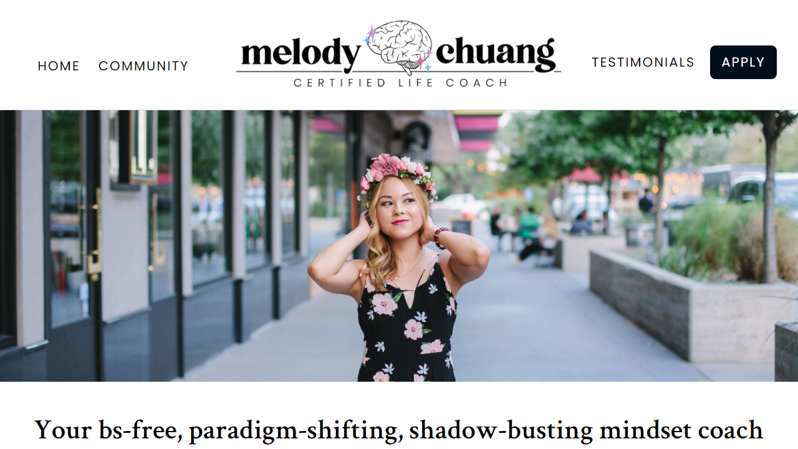

# Melody Chuang Coaching

Visit at: [melodychuang.com](https://melodychuang.com)

---

## 📝 Description

I created this website for my friend Melody's life coaching business. It was designed to replace a defunct Squarespace site and also represented an opportunity for me to practice making a responsive website with forms and some light SEO. A simple server runs in the backend to store submitted form data in a MongoDB Atlas database as well as send emails to both the business owner and form submitter. In addition, the website features widgets for Instagram, Facebook Groups, and Spotify.

## 🎬 Demo

### Home

### Widgets

### Forms

## 🤖 Versions

v1.0 Update assets and launch site

v0.2 Migrate to Next.js

v0.1 Deploy test site with placeholder assets

## 🚀 Technologies

- [Next.js](https://nextjs.org/)
- [React](https://reactjs.org/)
- [Node.js](https://nodejs.org/en/) / [Express](https://expressjs.com/)
- [Nodemailer](https://nodemailer.com/about/)
- [Axios](https://www.npmjs.com/package/axios)
- [Tailwind CSS](https://tailwindcss.com/)
- [Vercel](https://vercel.com/docs)
- [Heroku](https://www.heroku.com/)

## 🗃️ License

MIT © 2020 Michael W. Lu
